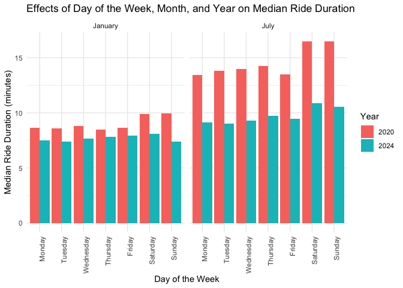
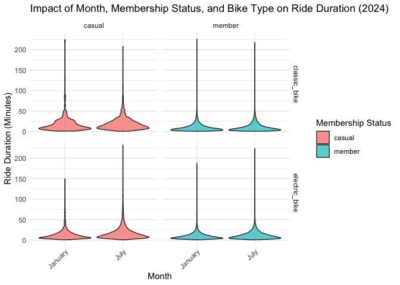

Hw3
================
Kangyu Xu (kx2224)
2024-10-17

``` r
library(p8105.datasets)
library(dplyr)
```

    ## 
    ## Attaching package: 'dplyr'

    ## The following objects are masked from 'package:stats':
    ## 
    ##     filter, lag

    ## The following objects are masked from 'package:base':
    ## 
    ##     intersect, setdiff, setequal, union

``` r
library(ggplot2)
library(lubridate)
```

    ## 
    ## Attaching package: 'lubridate'

    ## The following objects are masked from 'package:base':
    ## 
    ##     date, intersect, setdiff, union

``` r
library(tidyr)
library(tidyverse)
```

    ## ── Attaching core tidyverse packages ──────────────────────── tidyverse 2.0.0 ──
    ## ✔ forcats 1.0.0     ✔ stringr 1.5.1
    ## ✔ purrr   1.0.2     ✔ tibble  3.2.1
    ## ✔ readr   2.1.5

    ## ── Conflicts ────────────────────────────────────────── tidyverse_conflicts() ──
    ## ✖ dplyr::filter() masks stats::filter()
    ## ✖ dplyr::lag()    masks stats::lag()
    ## ℹ Use the conflicted package (<http://conflicted.r-lib.org/>) to force all conflicts to become errors

## Question1

``` r
data("ny_noaa")
str(ny_noaa)
```

    ## tibble [2,595,176 × 7] (S3: tbl_df/tbl/data.frame)
    ##  $ id  : chr [1:2595176] "US1NYAB0001" "US1NYAB0001" "US1NYAB0001" "US1NYAB0001" ...
    ##  $ date: Date[1:2595176], format: "2007-11-01" "2007-11-02" ...
    ##  $ prcp: int [1:2595176] NA NA NA NA NA NA NA NA NA NA ...
    ##  $ snow: int [1:2595176] NA NA NA NA NA NA NA NA NA NA ...
    ##  $ snwd: int [1:2595176] NA NA NA NA NA NA NA NA NA NA ...
    ##  $ tmax: chr [1:2595176] NA NA NA NA ...
    ##  $ tmin: chr [1:2595176] NA NA NA NA ...
    ##  - attr(*, "spec")=
    ##   .. cols(
    ##   ..   id = col_character(),
    ##   ..   date = col_date(format = ""),
    ##   ..   prcp = col_integer(),
    ##   ..   snow = col_integer(),
    ##   ..   snwd = col_integer(),
    ##   ..   tmax = col_character(),
    ##   ..   tmin = col_character()
    ##   .. )

``` r
dim(ny_noaa)
```

    ## [1] 2595176       7

### Dataset Description

The dataset contains 2595176 rows and 7 columns. The key variables
include:

1.  id: Identifier for the weather station.
2.  date: The date of observation.
3.  tmax: Maximum daily temperature (in tenths of degrees Celsius).
4.  tmin: Minimum daily temperature (in tenths of degrees Celsius).
5.  prcp: Precipitation in tenths of millimeters.
6.  snow: Snowfall in millimeters.
7.  snwd: Snow depth in millimeters.

### Data Cleaning

``` r
ny_noaa_cleaned = ny_noaa |>
  janitor::clean_names() |>
  mutate(tmax = as.numeric(tmax) / 10, 
         tmin = as.numeric(tmin) / 10,
         prcp = prcp / 10,
         year = year(date),
         month = month(date),
         day = day(date)) |> 
  select(year, month, day, everything(), -date) |>
  filter(tmax > tmin | is.na(tmax) | is.na(tmin)) |>
  filter(snow >= 0 | is.na(snow)) |>
  filter(!(is.na(snow) & is.na(snwd) & is.na(tmax) & is.na(tmin) & is.na(prcp))) |>
  rename(
    tmax_c = tmax,     
    tmin_c = tmin,     
    prcp_mm = prcp,   
    snow_mm = snow,    
    snwd_mm = snwd     
  )
```

``` r
snow_common = ny_noaa_cleaned |>
  count(snow_mm) |>
  arrange(desc(n))

snow_common
```

    ## # A tibble: 281 × 2
    ##    snow_mm       n
    ##      <int>   <int>
    ##  1       0 2007240
    ##  2      NA  308654
    ##  3      25   30981
    ##  4      13   23082
    ##  5      51   18253
    ##  6      76   10159
    ##  7       8    9959
    ##  8       5    9742
    ##  9      38    9186
    ## 10       3    8786
    ## # ℹ 271 more rows

For snowfall, the most commonly observed values is 0. It is because
almost days in New York will not snow.

### Plot

``` r
jan_jul_tmax = ny_noaa_cleaned |>
  filter(month %in% c(1, 7)) |>
  group_by(id, year, month) |>
  summarize(avg_tmax = mean(tmax_c, na.rm = TRUE))
```

    ## `summarise()` has grouped output by 'id', 'year'. You can override using the
    ## `.groups` argument.

``` r
ggplot(jan_jul_tmax, aes(x = year, y = avg_tmax, color = as.factor(month))) +
  geom_boxplot() +
  facet_wrap(~ month) +
  labs(title = "Average Max Temperature in January and July",
       x = "Year", y = "Max Temperature (°C)", color = "Month") +
  theme_minimal()
```

    ## Warning: Removed 5970 rows containing non-finite outside the scale range
    ## (`stat_boxplot()`).

<!-- -->
There appears to be some variability in the average maximum temperatures
across stations and years, particularly in July. Some stations show
outliers, with unusually high or low temperatures for certain.

### Plot -2

``` r
tmax_tmin_plot = ggplot(ny_noaa_cleaned, aes(x = tmin_c, y = tmax_c)) +
  geom_point(alpha = 0.3) +
  labs(title = "Tmax vs Tmin",
       x = "Min Temperature (°C)", y = "Max Temperature (°C)") +
  theme_minimal()

tmax_tmin_plot
```

    ## Warning: Removed 1063998 rows containing missing values or values outside the scale
    ## range (`geom_point()`).

<!-- -->

``` r
snowfall_violin = ny_noaa_cleaned |>
  filter(snow_mm > 0 & snow_mm < 100) |>
  ggplot(aes(x = factor(year), y = snow_mm)) +
  geom_violin() +
  labs(title = "Distribution of Snowfall by Year (0 < Snowfall < 100 mm)",
       x = "Year", y = "Snowfall (mm)") +
  theme_minimal() +
  theme(axis.text.x = element_text(angle = 90, hjust = 1))

snowfall_violin
```

<!-- --> \##
Problem 2

### Load data

``` r
demographic_data = read_csv("data/nhanes_covar.csv", na = c("NA", ".", ""), skip = 4) |>
  janitor::clean_names() 
```

    ## Rows: 250 Columns: 5
    ## ── Column specification ────────────────────────────────────────────────────────
    ## Delimiter: ","
    ## dbl (5): SEQN, sex, age, BMI, education
    ## 
    ## ℹ Use `spec()` to retrieve the full column specification for this data.
    ## ℹ Specify the column types or set `show_col_types = FALSE` to quiet this message.

``` r
accelerometer_data = read_csv("data/nhanes_accel.csv", na = c("NA", ".", "")) |>
  janitor::clean_names() 
```

    ## Rows: 250 Columns: 1441
    ## ── Column specification ────────────────────────────────────────────────────────
    ## Delimiter: ","
    ## dbl (1441): SEQN, min1, min2, min3, min4, min5, min6, min7, min8, min9, min1...
    ## 
    ## ℹ Use `spec()` to retrieve the full column specification for this data.
    ## ℹ Specify the column types or set `show_col_types = FALSE` to quiet this message.

### merge data

``` r
merged_data = left_join(demographic_data, accelerometer_data, by = "seqn")
```

### clean data

``` r
cleaned_data = merged_data |> 
  pivot_longer(cols = starts_with("min"),
               names_to = "minute",
               values_to = "acc") |>
  filter(age >= 21) |>
  drop_na(sex, age, bmi, education) |>
  mutate(
    sex = recode(sex, "1" = "Male", "2" = "Female"),
    education = recode(education, "1" = "Less than High School", "2" = "High School Equivalent", "3" = "More than High School"),
    sex = as_factor(sex), 
    education = fct_relevel(education, "Less than High School", "High School Equivalent", "More than High School"))
head(cleaned_data)
```

    ## # A tibble: 6 × 7
    ##    seqn sex     age   bmi education              minute   acc
    ##   <dbl> <fct> <dbl> <dbl> <fct>                  <chr>  <dbl>
    ## 1 62161 Male     22  23.3 High School Equivalent min1   1.11 
    ## 2 62161 Male     22  23.3 High School Equivalent min2   3.12 
    ## 3 62161 Male     22  23.3 High School Equivalent min3   1.47 
    ## 4 62161 Male     22  23.3 High School Equivalent min4   0.938
    ## 5 62161 Male     22  23.3 High School Equivalent min5   1.60 
    ## 6 62161 Male     22  23.3 High School Equivalent min6   0.145

### reader-friendly tabel

``` r
fri_data = cleaned_data |>
  group_by(sex, education) |>
  count()
head(fri_data)
```

    ## # A tibble: 6 × 3
    ## # Groups:   sex, education [6]
    ##   sex    education                  n
    ##   <fct>  <fct>                  <int>
    ## 1 Male   Less than High School  38880
    ## 2 Male   High School Equivalent 50400
    ## 3 Male   More than High School  80640
    ## 4 Female Less than High School  40320
    ## 5 Female High School Equivalent 33120
    ## 6 Female More than High School  84960

### plot

``` r
### Age distribution using violin plot
ggplot(cleaned_data, aes(x = education, y = age, fill = sex)) +
  geom_violin(trim = FALSE, scale = "width") +
  geom_boxplot(width = 0.1, position = position_dodge(0.9), color = "black", alpha = 0.2) +
  labs(title = "Age Distribution by Sex and Education (Violin Plot)",
       x = "Education Level",
       y = "Age",
       fill = "Sex") +
  theme_minimal() +
  theme(axis.text.x = element_text(angle = 45, hjust = 1))
```

<!-- -->
The violin plot shows that both men and women are primarily middle-aged
(40–60 years) across all education levels. In the “Less than High
School” group, women tend to be older, while men have a more even age
distribution. For “High School Equivalent,” men are concentrated around
ages 40–50, with women spanning a broader range. In “More than High
School,” both sexes cluster around 40–60, with women skewing slightly
older. Overall, women generally appear older across the categories,
particularly at lower education levels, but the distributions are
relatively similar.

``` r
### Aggregate total activity for each participant
total_activity_data = cleaned_data |>
  group_by(seqn, sex, age, education) |>
  summarize(total_activity = sum(acc, na.rm = TRUE))
```

    ## `summarise()` has grouped output by 'seqn', 'sex', 'age'. You can override
    ## using the `.groups` argument.

``` r
### Plot total activity against age, comparing men to women, with separate panels for education
ggplot(total_activity_data, aes(x = age, y = total_activity, color = sex)) +
  geom_point(alpha = 0.5) +  # Scatter plot for total activity
  geom_smooth(method = "loess", se = FALSE) +  # Add a smooth trend line
  facet_wrap(~education) +  # Separate panels by education level
  labs(title = "Total Activity vs. Age by Sex and Education Level",
       x = "Age",
       y = "Total Activity",
       color = "Sex") +
  theme_minimal()
```

    ## `geom_smooth()` using formula = 'y ~ x'

<!-- -->

1.  Less than High School: Women are more active than men at younger
    ages, but men have slightly higher activity levels after 60.

2.  High School Equivalent: Women show more variation in activity, with
    a peak around age 40, while men’s activity is more stable but lower.

3.  More than High School: Women maintain higher activity than men,
    especially between ages 50–60, though both sexes show a decline
    after 60.

``` r
time_course_data = cleaned_data |>
  group_by(minute, sex, education) |>
  summarize(mean_activity = mean(acc, na.rm = TRUE))
```

    ## `summarise()` has grouped output by 'minute', 'sex'. You can override using the
    ## `.groups` argument.

``` r
### 24-hour activity time course plot
ggplot(time_course_data, aes(x = as.numeric(gsub("min", "", minute)), y = mean_activity, color = sex)) +
  geom_line(size = 1, alpha = 0.7) +
  geom_smooth(se = FALSE, method = "loess", linetype = "dashed") +  # Smooth trend lines
  facet_wrap(~education) +
  labs(title = "24-Hour Activity Time Course by Education Level and Sex",
       x = "Time (Minutes from Start of Day)",
       y = "Mean Activity Level",
       color = "Sex") +
  theme_minimal()
```

    ## Warning: Using `size` aesthetic for lines was deprecated in ggplot2 3.4.0.
    ## ℹ Please use `linewidth` instead.
    ## This warning is displayed once every 8 hours.
    ## Call `lifecycle::last_lifecycle_warnings()` to see where this warning was
    ## generated.

    ## `geom_smooth()` using formula = 'y ~ x'

<!-- -->

1.  General Trends: Activity levels fluctuate throughout the day, with
    noticeable peaks and troughs indicating periods of increased and
    decreased movement.

2.  Sex Differences: Across all education levels, women may show
    slightly higher overall activity, especially during the middle of
    the day.

3.  Education Levels: The “More than High School” group might show more
    consistent activity throughout the day, while those with “Less than
    High School” may display more pronounced peaks and dips, suggesting
    less sustained activity.

## Problem 3

``` r
data_Jan_20 = 
  read_csv("data/Jan 2020 Citi.csv") |>
  mutate(date = as.Date("2020-01-01"))
```

    ## Rows: 12420 Columns: 7
    ## ── Column specification ────────────────────────────────────────────────────────
    ## Delimiter: ","
    ## chr (6): ride_id, rideable_type, weekdays, start_station_name, end_station_n...
    ## dbl (1): duration
    ## 
    ## ℹ Use `spec()` to retrieve the full column specification for this data.
    ## ℹ Specify the column types or set `show_col_types = FALSE` to quiet this message.

``` r
data_Jan_24 = 
  read_csv("data/Jan 2024 Citi.csv") |>
  mutate(date = as.Date("2024-01-01"))
```

    ## Rows: 18861 Columns: 7
    ## ── Column specification ────────────────────────────────────────────────────────
    ## Delimiter: ","
    ## chr (6): ride_id, rideable_type, weekdays, start_station_name, end_station_n...
    ## dbl (1): duration
    ## 
    ## ℹ Use `spec()` to retrieve the full column specification for this data.
    ## ℹ Specify the column types or set `show_col_types = FALSE` to quiet this message.

``` r
data_July_20 = 
  read_csv("data/July 2020 Citi.csv") |>
  mutate(date = as.Date("2020-07-01"))
```

    ## Rows: 21048 Columns: 7
    ## ── Column specification ────────────────────────────────────────────────────────
    ## Delimiter: ","
    ## chr (6): ride_id, rideable_type, weekdays, start_station_name, end_station_n...
    ## dbl (1): duration
    ## 
    ## ℹ Use `spec()` to retrieve the full column specification for this data.
    ## ℹ Specify the column types or set `show_col_types = FALSE` to quiet this message.

``` r
data_July_24 = 
  read_csv("data/July 2024 Citi.csv") |>
  mutate(date = as.Date("2024-07-01"))
```

    ## Rows: 47156 Columns: 7
    ## ── Column specification ────────────────────────────────────────────────────────
    ## Delimiter: ","
    ## chr (6): ride_id, rideable_type, weekdays, start_station_name, end_station_n...
    ## dbl (1): duration
    ## 
    ## ℹ Use `spec()` to retrieve the full column specification for this data.
    ## ℹ Specify the column types or set `show_col_types = FALSE` to quiet this message.

### Clean data

``` r
total_data = 
  bind_rows(data_Jan_20,data_Jan_24,data_July_20,data_July_24)|>
  distinct()|>
  janitor::clean_names()|>
  pivot_longer(start_station_name: end_station_name, names_to = "station_status", values_to = "station_name", names_pattern = "(start|end)_station_name")

head(total_data)
```

    ## # A tibble: 6 × 8
    ##   ride_id          rideable_type weekdays  duration member_casual date      
    ##   <chr>            <chr>         <chr>        <dbl> <chr>         <date>    
    ## 1 4BE06CB33B037044 classic_bike  Tuesday      15.3  member        2020-01-01
    ## 2 4BE06CB33B037044 classic_bike  Tuesday      15.3  member        2020-01-01
    ## 3 26886E034974493B classic_bike  Wednesday     5.31 member        2020-01-01
    ## 4 26886E034974493B classic_bike  Wednesday     5.31 member        2020-01-01
    ## 5 24DC56060EBE6260 classic_bike  Friday        9.69 member        2020-01-01
    ## 6 24DC56060EBE6260 classic_bike  Friday        9.69 member        2020-01-01
    ## # ℹ 2 more variables: station_status <chr>, station_name <chr>

### Data information summary

``` r
bike_type = total_data|> pull(rideable_type)|> unique()
most_weekdays = total_data|> count(weekdays)|> arrange(desc(n))
avg_duration = total_data|> pull(duration)|> mean(na.rm = TRUE)
num_member = total_data|> count(member_casual)
bike_type
```

    ## [1] "classic_bike"  "electric_bike"

``` r
most_weekdays
```

    ## # A tibble: 7 × 2
    ##   weekdays      n
    ##   <chr>     <int>
    ## 1 Wednesday 33768
    ## 2 Tuesday   31048
    ## 3 Thursday  30046
    ## 4 Monday    28998
    ## 5 Friday    27268
    ## 6 Saturday  24870
    ## 7 Sunday    22972

``` r
avg_duration
```

    ## [1] 13.93014

``` r
num_member
```

    ## # A tibble: 2 × 2
    ##   member_casual      n
    ##   <chr>          <int>
    ## 1 casual         39246
    ## 2 member        159724

- So the combine data set contains 9.9485^{4} order information. This
  dataset concludes the information of each ride’s duration, date, start
  station, end station, ride type and the ride weekdays.
- The bike types contains classic_bike, electric_bike. The most busy
  weekdays to ride bike is Wednesday, and the number of orders is 33768.
  The average duration of ride is 13.9301375. The percentage of members
  is 0.8027542.

### Make table of total number of rides in each combination.

``` r
total_rides_table = total_data |>
  mutate(year = format(date, "%Y"), 
         month = format(date, "%B")) |>
  group_by(year, month, member_casual) |>
  summarize(total_rides = n(), .groups = 'drop') |>
  pivot_wider(names_from = member_casual, values_from = total_rides, values_fill = 0) |>
  mutate(total_rides = member + casual,
         member_proportion = member / total_rides) |>
  arrange(year, match(month, month.name))

# Display the table in a reader-friendly format
library(knitr)
kable(total_rides_table, caption = "Total Number of Rides and Member Rider Proportion by Year, Month, and Rider Type", digits = 2)
```

| year | month   | casual | member | total_rides | member_proportion |
|:-----|:--------|-------:|-------:|------------:|------------------:|
| 2020 | January |   1968 |  22872 |       24840 |              0.92 |
| 2020 | July    |  11274 |  30822 |       42096 |              0.73 |
| 2024 | January |   4216 |  33506 |       37722 |              0.89 |
| 2024 | July    |  21788 |  72524 |       94312 |              0.77 |

Total Number of Rides and Member Rider Proportion by Year, Month, and
Rider Type

- Therefore, the number of riders will increase on summer both 2020
  and 2024. Also the proportion of member riders will decreases on
  summer. From 2020 to 2024, the number of both kinds of riders
  increases a lot.

### make a table of 5 most popular starting stations

``` r
top_stations_July_24 = total_data |>
  filter(format(date, "%Y-%m") == "2024-07", station_status == "start") |>
  count(station_name, sort = TRUE) |>
  top_n(5, n)

# Display the top 5 stations table
kable(top_stations_July_24, caption = "Top 5 Most Popular Starting Stations for July 2024", col.names = c("Station Name", "Number of Rides"))
```

| Station Name             | Number of Rides |
|:-------------------------|----------------:|
| Pier 61 at Chelsea Piers |             163 |
| University Pl & E 14 St  |             155 |
| W 21 St & 6 Ave          |             152 |
| West St & Chambers St    |             150 |
| W 31 St & 7 Ave          |             146 |

Top 5 Most Popular Starting Stations for July 2024

- The 5 most popular starting stations for July 2024 are: Pier 61 at
  Chelsea Piers: 163 rides; University Pl & E 14 St: 155 rides; W 21 St
  & 6 Ave: 152 rides; West St & Chambers St: 150 rides; W 31 St & 7 Ave:
  146 rides.

### Plot of the effect of day of the week

``` r
### Prepare data for plotting median ride duration by day of the week, month, and year
ride_duration_data = total_data |>
  mutate(year = format(date, "%Y"),
         month = format(date, "%B"),
         weekdays = fct_relevel(weekdays, "Monday", "Tuesday", "Wednesday", "Thursday", "Friday", "Saturday", "Sunday")) |>
  group_by(year, month, weekdays) |>
  summarize(median_duration = median(duration, na.rm = TRUE))
```

    ## `summarise()` has grouped output by 'year', 'month'. You can override using the
    ## `.groups` argument.

``` r
ride_duration_data
```

    ## # A tibble: 28 × 4
    ## # Groups:   year, month [4]
    ##    year  month   weekdays  median_duration
    ##    <chr> <chr>   <fct>               <dbl>
    ##  1 2020  January Monday               8.66
    ##  2 2020  January Tuesday              8.57
    ##  3 2020  January Wednesday            8.80
    ##  4 2020  January Thursday             8.50
    ##  5 2020  January Friday               8.64
    ##  6 2020  January Saturday             9.88
    ##  7 2020  January Sunday               9.97
    ##  8 2020  July    Monday              13.4 
    ##  9 2020  July    Tuesday             13.8 
    ## 10 2020  July    Wednesday           14.0 
    ## # ℹ 18 more rows

``` r
ride_duration_plot = ggplot(ride_duration_data, aes(x = weekdays, y = median_duration, fill = year)) +
  geom_bar(stat = 'identity', position = position_dodge()) +  # Bar plot with dodge position for months
  facet_grid(. ~ month) +  # Separate panels for each year
  labs(title = 'Effects of Day of the Week, Month, and Year on Median Ride Duration',
       x = 'Day of the Week',
       y = 'Median Ride Duration (minutes)',
       fill = 'Year') +
  theme_minimal() +  # Use a minimal theme for clean aesthetics
  theme(axis.text.x = element_text(angle = 90, hjust = 1))  # Rotate X-axis labels for better readability

# Display the plot
ride_duration_plot
```

<!-- -->

- In 2020, the median ride duration appears to be consistently higher
  compared to 2024, particularly for the month of July. This could
  indicate a trend where people in 2020 took longer rides, possibly due
  to different social factors, infrastructure, or external conditions.

- The weekend days (Saturday and Sunday) in both January and July tend
  to show higher median ride durations compared to weekdays. This
  suggests that people may be using the service for leisure activities
  on weekends, resulting in longer rides. During weekdays, the median
  ride durations are more uniform and shorter, especially in January for
  both years, which might reflect more commuter-based usage during the
  workweek.

### Make a figure

``` r
data_2024 = total_data |>
  mutate(
    month = format(date, "%B"),
    year = format(date, "%Y")
  )|>
  filter(year == "2024")
head(data_2024)
```

    ## # A tibble: 6 × 10
    ##   ride_id          rideable_type weekdays  duration member_casual date      
    ##   <chr>            <chr>         <chr>        <dbl> <chr>         <date>    
    ## 1 644A0105ACA27B15 electric_bike Wednesday    16.5  member        2024-01-01
    ## 2 644A0105ACA27B15 electric_bike Wednesday    16.5  member        2024-01-01
    ## 3 A5A8C0AD18EDA2C0 electric_bike Wednesday     6.29 member        2024-01-01
    ## 4 A5A8C0AD18EDA2C0 electric_bike Wednesday     6.29 member        2024-01-01
    ## 5 B392CE3496831A89 electric_bike Tuesday       6.12 member        2024-01-01
    ## 6 B392CE3496831A89 electric_bike Tuesday       6.12 member        2024-01-01
    ## # ℹ 4 more variables: station_status <chr>, station_name <chr>, month <chr>,
    ## #   year <chr>

``` r
ride_duration_plot_2024 = 
  ggplot(
    data_2024, 
    aes(x = month, y = duration, fill = member_casual)
    ) + 
  geom_violin(alpha = 0.7, scale = "width") +  
  facet_grid(rideable_type ~ member_casual) +  
  labs(
    title = "Impact of Month, Membership Status, and Bike Type on Ride Duration (2024)",
    x = "Month", 
    y = "Ride Duration (Minutes)", 
    fill = "Membership Status"
    ) +
  theme_minimal() +  
  theme(axis.text.x = element_text(angle = 45, hjust = 1))  

ride_duration_plot_2024
```

<!-- -->

1.  Casual Riders vs. Members:

- Casual riders (shown in pink) tend to have much longer ride durations
  compared to members (shown in blue), especially for classic bikes.
  This suggests that casual riders might use bikes more for leisure or
  sightseeing, resulting in longer trips. Members, on the other hand,
  have consistently shorter and more uniform ride durations, indicating
  more utilitarian or commuting use, especially for electric bikes.

2.  Bike Type Impact:

- Electric bikes show generally shorter ride durations compared to
  classic bikes for both casual riders and members. This is likely
  because electric bikes are used for quicker, more efficient trips,
  particularly by members.

- Casual riders on classic bikes exhibit a much wider distribution in
  ride duration, with some very long rides, especially in July.

3.  Seasonal Differences (January vs. July):

- Ride durations are longer in July compared to January for casual
  riders, likely due to better weather conditions encouraging more
  leisurely and extended rides.

- For members, there is less seasonal variation in ride durations,
  suggesting that their riding patterns are more consistent throughout
  the year, likely due to commuting.
