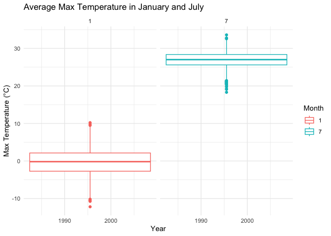
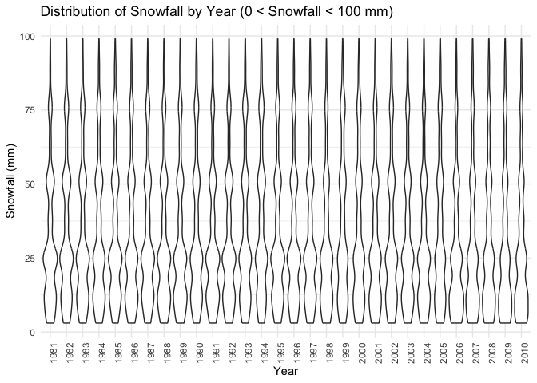
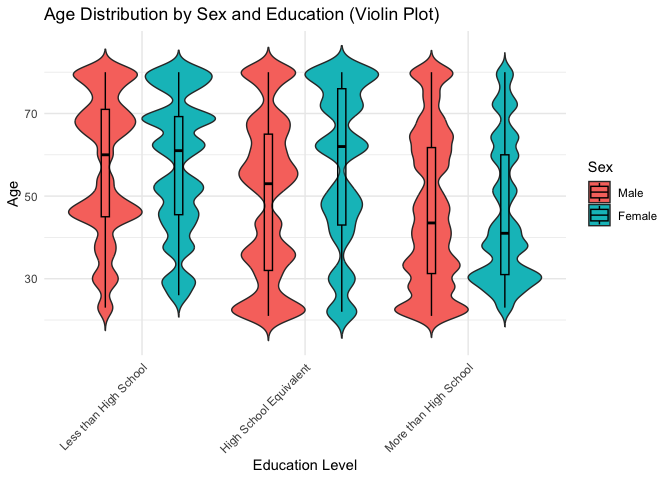
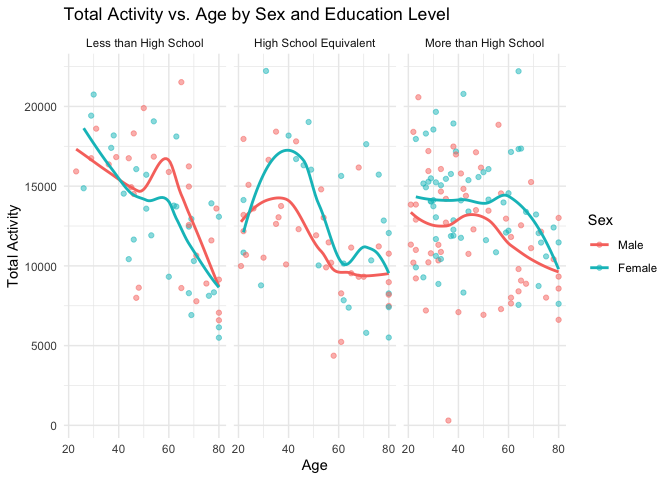
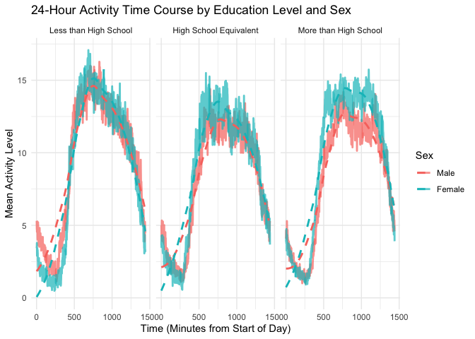

Hw3
================
Kangyu Xu (kx2224)
2024-10-17

``` r
library(p8105.datasets)
library(dplyr)
```

    ## 
    ## Attaching package: 'dplyr'

    ## The following objects are masked from 'package:stats':
    ## 
    ##     filter, lag

    ## The following objects are masked from 'package:base':
    ## 
    ##     intersect, setdiff, setequal, union

``` r
library(ggplot2)
library(lubridate)
```

    ## 
    ## Attaching package: 'lubridate'

    ## The following objects are masked from 'package:base':
    ## 
    ##     date, intersect, setdiff, union

``` r
library(tidyr)
library(tidyverse)
```

    ## ── Attaching core tidyverse packages ──────────────────────── tidyverse 2.0.0 ──
    ## ✔ forcats 1.0.0     ✔ stringr 1.5.1
    ## ✔ purrr   1.0.2     ✔ tibble  3.2.1
    ## ✔ readr   2.1.5

    ## ── Conflicts ────────────────────────────────────────── tidyverse_conflicts() ──
    ## ✖ dplyr::filter() masks stats::filter()
    ## ✖ dplyr::lag()    masks stats::lag()
    ## ℹ Use the conflicted package (<http://conflicted.r-lib.org/>) to force all conflicts to become errors

## Question1

``` r
data("ny_noaa")
str(ny_noaa)
```

    ## tibble [2,595,176 × 7] (S3: tbl_df/tbl/data.frame)
    ##  $ id  : chr [1:2595176] "US1NYAB0001" "US1NYAB0001" "US1NYAB0001" "US1NYAB0001" ...
    ##  $ date: Date[1:2595176], format: "2007-11-01" "2007-11-02" ...
    ##  $ prcp: int [1:2595176] NA NA NA NA NA NA NA NA NA NA ...
    ##  $ snow: int [1:2595176] NA NA NA NA NA NA NA NA NA NA ...
    ##  $ snwd: int [1:2595176] NA NA NA NA NA NA NA NA NA NA ...
    ##  $ tmax: chr [1:2595176] NA NA NA NA ...
    ##  $ tmin: chr [1:2595176] NA NA NA NA ...
    ##  - attr(*, "spec")=
    ##   .. cols(
    ##   ..   id = col_character(),
    ##   ..   date = col_date(format = ""),
    ##   ..   prcp = col_integer(),
    ##   ..   snow = col_integer(),
    ##   ..   snwd = col_integer(),
    ##   ..   tmax = col_character(),
    ##   ..   tmin = col_character()
    ##   .. )

``` r
dim(ny_noaa)
```

    ## [1] 2595176       7

### Dataset Description

The dataset contains 2595176 rows and 7 columns. The key variables
include:

1.  id: Identifier for the weather station.
2.  date: The date of observation.
3.  tmax: Maximum daily temperature (in tenths of degrees Celsius).
4.  tmin: Minimum daily temperature (in tenths of degrees Celsius).
5.  prcp: Precipitation in tenths of millimeters.
6.  snow: Snowfall in millimeters.
7.  snwd: Snow depth in millimeters.

### Data Cleaning

``` r
ny_noaa_cleaned = ny_noaa |>
  janitor::clean_names() |>
  mutate(tmax = as.numeric(tmax) / 10, 
         tmin = as.numeric(tmin) / 10,
         prcp = prcp / 10,
         year = year(date),
         month = month(date),
         day = day(date)) |> 
  select(year, month, day, everything(), -date) |>
  filter(tmax > tmin | is.na(tmax) | is.na(tmin)) |>
  filter(snow >= 0 | is.na(snow)) |>
  filter(!(is.na(snow) & is.na(snwd) & is.na(tmax) & is.na(tmin) & is.na(prcp))) |>
  rename(
    tmax_c = tmax,     
    tmin_c = tmin,     
    prcp_mm = prcp,   
    snow_mm = snow,    
    snwd_mm = snwd     
  )
```

``` r
snow_common <- ny_noaa_cleaned %>%
  count(snow_mm) %>%
  arrange(desc(n))

snow_common
```

    ## # A tibble: 281 × 2
    ##    snow_mm       n
    ##      <int>   <int>
    ##  1       0 2007240
    ##  2      NA  308654
    ##  3      25   30981
    ##  4      13   23082
    ##  5      51   18253
    ##  6      76   10159
    ##  7       8    9959
    ##  8       5    9742
    ##  9      38    9186
    ## 10       3    8786
    ## # ℹ 271 more rows

For snowfall, the most commonly observed values is 0. It is because
almost days in New York will not snow.

### Plot

``` r
jan_jul_tmax <- ny_noaa_cleaned %>%
  filter(month %in% c(1, 7)) %>%
  group_by(id, year, month) %>%
  summarize(avg_tmax = mean(tmax_c, na.rm = TRUE))
```

    ## `summarise()` has grouped output by 'id', 'year'. You can override using the
    ## `.groups` argument.

``` r
ggplot(jan_jul_tmax, aes(x = year, y = avg_tmax, color = as.factor(month))) +
  geom_boxplot() +
  facet_wrap(~ month) +
  labs(title = "Average Max Temperature in January and July",
       x = "Year", y = "Max Temperature (°C)", color = "Month") +
  theme_minimal()
```

    ## Warning: Removed 5970 rows containing non-finite outside the scale range
    ## (`stat_boxplot()`).

<!-- -->
There appears to be some variability in the average maximum temperatures
across stations and years, particularly in July. Some stations show
outliers, with unusually high or low temperatures for certain.

### Plot -2

``` r
tmax_tmin_plot <- ggplot(ny_noaa_cleaned, aes(x = tmin_c, y = tmax_c)) +
  geom_point(alpha = 0.3) +
  labs(title = "Tmax vs Tmin",
       x = "Min Temperature (°C)", y = "Max Temperature (°C)") +
  theme_minimal()

tmax_tmin_plot
```

    ## Warning: Removed 1063998 rows containing missing values or values outside the scale
    ## range (`geom_point()`).

<!-- -->

``` r
snowfall_violin <- ny_noaa_cleaned %>%
  filter(snow_mm > 0 & snow_mm < 100) %>%
  ggplot(aes(x = factor(year), y = snow_mm)) +
  geom_violin() +
  labs(title = "Distribution of Snowfall by Year (0 < Snowfall < 100 mm)",
       x = "Year", y = "Snowfall (mm)") +
  theme_minimal() +
  theme(axis.text.x = element_text(angle = 90, hjust = 1))

snowfall_violin
```

<!-- --> \##
Problem 2

### Load data

``` r
demographic_data = read_csv("data/nhanes_covar.csv", na = c("NA", ".", ""), skip = 4) |>
  janitor::clean_names() 
```

    ## Rows: 250 Columns: 5
    ## ── Column specification ────────────────────────────────────────────────────────
    ## Delimiter: ","
    ## dbl (5): SEQN, sex, age, BMI, education
    ## 
    ## ℹ Use `spec()` to retrieve the full column specification for this data.
    ## ℹ Specify the column types or set `show_col_types = FALSE` to quiet this message.

``` r
accelerometer_data = read_csv("data/nhanes_accel.csv", na = c("NA", ".", "")) |>
  janitor::clean_names() 
```

    ## Rows: 250 Columns: 1441
    ## ── Column specification ────────────────────────────────────────────────────────
    ## Delimiter: ","
    ## dbl (1441): SEQN, min1, min2, min3, min4, min5, min6, min7, min8, min9, min1...
    ## 
    ## ℹ Use `spec()` to retrieve the full column specification for this data.
    ## ℹ Specify the column types or set `show_col_types = FALSE` to quiet this message.

### merge data

``` r
merged_data = left_join(demographic_data, accelerometer_data, by = "seqn")
```

### clean data

``` r
cleaned_data = merged_data |> 
  pivot_longer(cols = starts_with("min"),
               names_to = "minute",
               values_to = "acc") |>
  filter(age >= 21) |>
  drop_na(sex, age, bmi, education) |>
  mutate(
    sex = recode(sex, "1" = "Male", "2" = "Female"),
    education = recode(education, "1" = "Less than High School", "2" = "High School Equivalent", "3" = "More than High School"),
    sex = as_factor(sex), 
    education = fct_relevel(education, "Less than High School", "High School Equivalent", "More than High School"))
head(cleaned_data)
```

    ## # A tibble: 6 × 7
    ##    seqn sex     age   bmi education              minute   acc
    ##   <dbl> <fct> <dbl> <dbl> <fct>                  <chr>  <dbl>
    ## 1 62161 Male     22  23.3 High School Equivalent min1   1.11 
    ## 2 62161 Male     22  23.3 High School Equivalent min2   3.12 
    ## 3 62161 Male     22  23.3 High School Equivalent min3   1.47 
    ## 4 62161 Male     22  23.3 High School Equivalent min4   0.938
    ## 5 62161 Male     22  23.3 High School Equivalent min5   1.60 
    ## 6 62161 Male     22  23.3 High School Equivalent min6   0.145

### reader-friendly tabel

``` r
fri_data = cleaned_data |>
  group_by(sex, education) |>
  count()
head(fri_data)
```

    ## # A tibble: 6 × 3
    ## # Groups:   sex, education [6]
    ##   sex    education                  n
    ##   <fct>  <fct>                  <int>
    ## 1 Male   Less than High School  38880
    ## 2 Male   High School Equivalent 50400
    ## 3 Male   More than High School  80640
    ## 4 Female Less than High School  40320
    ## 5 Female High School Equivalent 33120
    ## 6 Female More than High School  84960

### plot

``` r
### Age distribution using violin plot
ggplot(cleaned_data, aes(x = education, y = age, fill = sex)) +
  geom_violin(trim = FALSE, scale = "width") +
  geom_boxplot(width = 0.1, position = position_dodge(0.9), color = "black", alpha = 0.2) +
  labs(title = "Age Distribution by Sex and Education (Violin Plot)",
       x = "Education Level",
       y = "Age",
       fill = "Sex") +
  theme_minimal() +
  theme(axis.text.x = element_text(angle = 45, hjust = 1))
```

<!-- -->
The violin plot shows that both men and women are primarily middle-aged
(40–60 years) across all education levels. In the “Less than High
School” group, women tend to be older, while men have a more even age
distribution. For “High School Equivalent,” men are concentrated around
ages 40–50, with women spanning a broader range. In “More than High
School,” both sexes cluster around 40–60, with women skewing slightly
older. Overall, women generally appear older across the categories,
particularly at lower education levels, but the distributions are
relatively similar.

``` r
### Aggregate total activity for each participant
total_activity_data = cleaned_data |>
  group_by(seqn, sex, age, education) |>
  summarize(total_activity = sum(acc, na.rm = TRUE))
```

    ## `summarise()` has grouped output by 'seqn', 'sex', 'age'. You can override
    ## using the `.groups` argument.

``` r
### Plot total activity against age, comparing men to women, with separate panels for education
ggplot(total_activity_data, aes(x = age, y = total_activity, color = sex)) +
  geom_point(alpha = 0.5) +  # Scatter plot for total activity
  geom_smooth(method = "loess", se = FALSE) +  # Add a smooth trend line
  facet_wrap(~education) +  # Separate panels by education level
  labs(title = "Total Activity vs. Age by Sex and Education Level",
       x = "Age",
       y = "Total Activity",
       color = "Sex") +
  theme_minimal()
```

    ## `geom_smooth()` using formula = 'y ~ x'

<!-- -->

1.  Less than High School: Women are more active than men at younger
    ages, but men have slightly higher activity levels after 60.

2.  High School Equivalent: Women show more variation in activity, with
    a peak around age 40, while men’s activity is more stable but lower.

3.  More than High School: Women maintain higher activity than men,
    especially between ages 50–60, though both sexes show a decline
    after 60.

``` r
time_course_data <- cleaned_data %>%
  group_by(minute, sex, education) %>%
  summarize(mean_activity = mean(acc, na.rm = TRUE))
```

    ## `summarise()` has grouped output by 'minute', 'sex'. You can override using the
    ## `.groups` argument.

``` r
### 24-hour activity time course plot
ggplot(time_course_data, aes(x = as.numeric(gsub("min", "", minute)), y = mean_activity, color = sex)) +
  geom_line(size = 1, alpha = 0.7) +
  geom_smooth(se = FALSE, method = "loess", linetype = "dashed") +  # Smooth trend lines
  facet_wrap(~education) +
  labs(title = "24-Hour Activity Time Course by Education Level and Sex",
       x = "Time (Minutes from Start of Day)",
       y = "Mean Activity Level",
       color = "Sex") +
  theme_minimal()
```

    ## Warning: Using `size` aesthetic for lines was deprecated in ggplot2 3.4.0.
    ## ℹ Please use `linewidth` instead.
    ## This warning is displayed once every 8 hours.
    ## Call `lifecycle::last_lifecycle_warnings()` to see where this warning was
    ## generated.

    ## `geom_smooth()` using formula = 'y ~ x'

<!-- -->

1.  General Trends: Activity levels fluctuate throughout the day, with
    noticeable peaks and troughs indicating periods of increased and
    decreased movement.

2.  Sex Differences: Across all education levels, women may show
    slightly higher overall activity, especially during the middle of
    the day.

3.  Education Levels: The “More than High School” group might show more
    consistent activity throughout the day, while those with “Less than
    High School” may display more pronounced peaks and dips, suggesting
    less sustained activity.

## Problem 3
